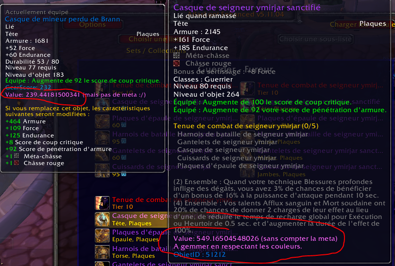

# FuryValue

Un petit addon qui calcule l'apport de stats brutes DPS des objets (ici appelé "value") pour warfury 3.3.5a (ne prend pas en compte le niveau d'objet, ou l'endurance mais bien les stats dps uniquement).

Fonctionne aussi bien avec les tooltips "normales" que celles d'atlas-loot.

Aucune configuration requise.

Mes calculs prennent en compte pas mal de variables comme la bok, buffs en raids, talents (**Armé jusqu'aux dents 3/3 et Posture berserker améliorée 5/5**), etc... :

**1 value = 1 score de pénétration d'armure = 1 score d'expertise = 1 au score de toucher = 2 au score de hâte = 64.8 armure = 0.69 force = 1.8 puissance d'attaque = 0.999 au score de crit = 1.2225 agilité**

Lorsque l'addon détecte des slots de gemmes, il va calculer plusieurs combinaisons à base de gemmes épiques rouges force, gemmes orange crit/force et gemmes vertes force/endu. L'addon retiendra la combinaison ayant le plus de "value" et vous indiquera s'il est rentable de gemmer en fonction du bonus de châsse ou non.

Gardez bien à l'esprit que :

1) Mes calculs sont 100% subjectifs. Par exemple, je part du principe que 1 toucher = 2 hâte. Pourquoi ? Parce que L'Oréal ! (Et aussi parce que la hâte plus t'en as et moins c'est pratique. Mais quand même, le 1 toucher = 2 hâte par exemple sort de mon cul ^^).

2) Les scores affichés ne prennent pas en compte les différents caps. Si vous êtes capés toucher par exemple, vous préfèrez sûrement équiper une cape sans toucher à 250 value qu'une cape à 300 value avec toucher. Tout comme le gearscore, ce n'est qu'une indication, plus précise certes, mais une indication quand même.

/!\ Testé uniquement sur client FR /!\

Made by [Pseudo](https://way-of-elendil.fr/armory/character/779469-pseudo) pour [Pseudo](https://way-of-elendil.fr/armory/character/779469-pseudo).

